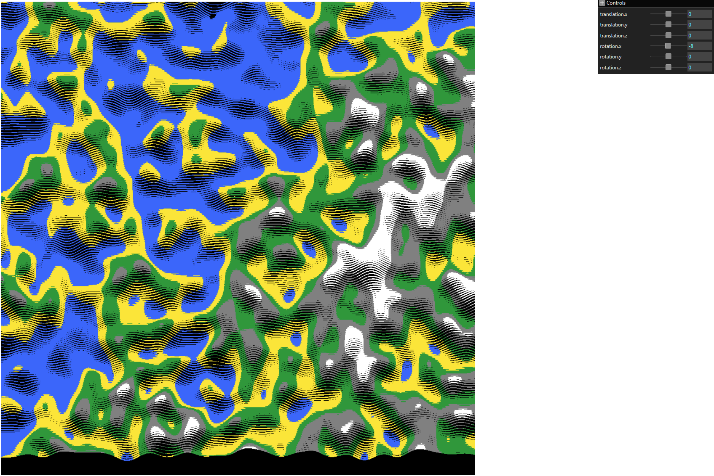

Basic 3D Landscape Generation. 
Perlin Noise sourced from here - https://github.com/josephg/noisejs
3D Matrix Math Logic + GUI logic sourced from this course - https://webgpufundamentals.org/webgpu/lessons/webgpu-translation.html

PS - 
1) Need to add culling to make rendering more accurate.
2) Swapping top and bottom vertices gives continuous cell rendering in the shader. 
